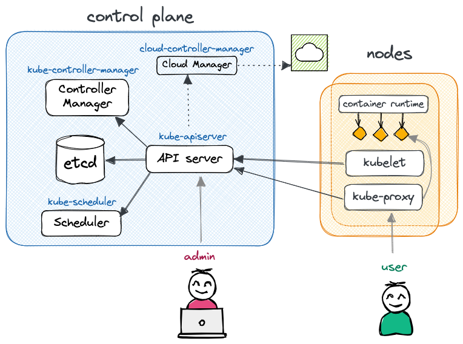

We first need a Kubernetes cluster. As mentioned in the introduction, there are lots available.
Instead of running locally (using e.g. k3d), let's use the [Scalable Kubernetes Service (SKS)](
https://community.exoscale.com/documentation/sks) from [Exoscale](https://exoscale.com),
using the *starter* pricing tier.

!!! note ""

    For the time being, consider "pod" a synonym for a container. We will see later
    the difference between regular containers and k8s pods. 

??? tip "Using a local Kubernetes cluster"

    If you do not have an account on Exoscale, or simply do not want to use a managed
    cluster, you can run everything on your machine using Kubernetes in Docker.
    For more information, head to the [Want to work locally?](#want-to-work-locally)
    section on this page.

## Spawn an SKS cluster

You'll find a terraform module in this repository that you can use to spin up your own.
The only thing you need is a valid API key and secret.

Login to Exoscale, navigate to *IAM* > *API KEY* and create a new key.
On your terminal, do:
```bash
TF_VAR_exoscale_api_key=<your key>
TF_VAR_exoscale_api_secret=<your secret>
```

Now you are ready. Navigate to `terraform` and run:
```bash
terraform init
terraform plan
terraform apply -auto-approve
```

Wait a few minutes, and boom! You have a Kubernetes cluster.
Copy and paste the output in your terminal, something like:
```bash
export KUBECONFIG=...; kubectl cluster-info
```

Finally, install the Nginx Ingress Controller by running:
```bash
## Ensure you exported KUBECONFIG=... first!
kubectl apply -f https://raw.githubusercontent.com/kubernetes/ingress-nginx/main/deploy/static/provider/exoscale/deploy.yaml
```

(The Nginx Ingress Controller was initially installed in terraform - see `terraform/main.tf`,
but the destroy often fails, so better to do it manually.)

!!! warning "Don't forget to stop the cluster"

    Once you finished experimenting, don't forget to destroy your cluster
    to avoid unecessary costs:
    ```bash
    # Uninstall Nginx Ingress Controller first,
    # or the load balancer on exoscale will stay there and cost you
    kubectl destroy -f https://raw.githubusercontent.com/kubernetes/ingress-nginx/main/deploy/static/provider/exoscale/deploy.yaml
    # Then destroy the cluster
    terraform destroy -auto-approve
    ```
    Always go to the Exoscale Console and ensure there is no remaining Load Balancers.
    You never know, and load balancers are expensive!

## What composes a Kubernetes cluster?

Kubernetes is a distributed system that consists of two main components: the control plane and the nodes.
You communicate with the API server running in the control plane, and it takes the necessary action to
make your workload run on some worker node(s).

Need an analogy? Checkout [Demystifying the Nuts & Bolts of Kubernetes Architecture](
https://www.slideshare.net/ajeetraina/demystifying-the-nuts-bolts-of-kubernetes-architecture)
and [What is Kubernetes? Confused? Kubernetes and its Architecture Explained in Plain English](
https://telcocloudbridge.com/blog/what-is-kubernetes-and-its-architecture/)



The **control plane** is responsible for managing and orchestrating the various workloads that run on the nodes.
It typically runs on a dedicated set of machines (separated from the worker nodes) and includes several key components:

API Server (`kube-apiserver`)
:   The API server acts as the control plane's frontend, providing a RESTful API for users and other components to interact with.

etcd
:   etcd is a distributed key-value store that stores the cluster's configuration data and provides a reliable storage layer for the control plane.
As you will see, k8s is declarative. All the states of the nodes, workloads, etc (in YAML or JSON format) are stored in etcd.

Scheduler (`kube-scheduler`)
:   The scheduler is responsible for determining which nodes in the cluster should run which pod.
It takes into account many things such as the resource needs of the pods, such as CPU or memory, and the health of the cluster
to make a decision. 

Controller Manager (`kube-controller-manager`)
:   The controller manager is responsible for running the core controllers that regulate the state of the cluster:
Node controller (nodes down or added), Job controller, EndpointSlice controller, ServiceAccount controller, etc.
Logically, each controller is a separate process, but to reduce complexity, they are all compiled into a single binary and run in a single process.

(*optional*) Cluster Controller Manager (`cloud-controller-manager`)
:   The cluster controller manager is only present when running a managed Kubernetes in the cloud (vs on-prem).
It embeds cloud-specific logic specific to your cloud provider e.g. to manage routes, load balancers, nodes, etc.

The **nodes**, on the other hand, are the actual worker machines that run the containers and workloads 
and are managed by the control plane (communicating through the API server). A node includes the following components:

Container runtime
:   The software responsible for running containers. It can be any implementation of the [Kubernetes CRI (Container Runtime Interface)](
    https://github.com/kubernetes/community/blob/master/contributors/devel/sig-node/container-runtime-interface.md), but most usually containerd or CRI-O.

`kubelet`
:   kubelet is the agent responsible for managing Kubernetes pods on the machine, ensuring they are running and healthy.
It also constantly communicates with the control plane about the status of the nodes and the containers running on it.

`kube-proxy`
:   kube-proxy maintains network rules on nodes, to allow network communication to pods from network sessions inside or outside the cluster.
It typically relies on `iptables` (if available).

In the most minimal setup (e.g. k3d), one control plane and one node can run on a single machine.
For a minimal HA - high availability - cluster, one would rather have three machines: one control plane and two workers.
More nodes can be added to sustain the workload, and it is recommended to also make the control plane fault tolerant
by scaling it horizontally on multiple machines.


## What was installed?

When creating the SKS cluster above, we created:

* a Kubernetes **control plane** (with an Exoscale Cloud Controller Manager),
* an Exoscale *nodepool*, which provisioned two compute instances that were registered as Kubernetes **nodes** (or **worker nodes**).

Additionally, Exoscale's SKS automatically installs:

* The CNI[^1] plugin [Calico](https://www.tigera.io/project-calico/): to manage the cluster network and add support for network policies,
  security, and better encapsulation;
  see [Kubernetes CNI Explained](https://www.tigera.io/learn/guides/kubernetes-networking/kubernetes-cni/).
* [CoreDNS](https://coredns.io/): a DNS server that provides service discovery and name resolution for Kubernetes services and pods,
  allowing them to communicate with each other using human-readable domain names;
* [Konnectivity](https://github.com/kubernetes-sigs/apiserver-network-proxy): a tool that enables secure,
  in-cluster communication between nodes and pods across different Kubernetes clusters,
  providing a way to establish encrypted and authenticated connections over the public internet;
* [Metrics server](https://github.com/kubernetes-sigs/metrics-server): an agent that collects resource metrics
  from Kubelets and exposes them through the Kubernetes API server (`kubectl top`).

But this is not all! The terraform script also potentially adds (see comments in `terraform/main.tf`):

* The [NGINX Ingress Controller](https://kubernetes.github.io/ingress-nginx/user-guide/nginx-configuration/): to provide extrernal
  access and manage routes (i.e. `Ingress`) based on hosts, path prefix, etc.
* [Longhorn](longhorn.io/): a distributed block storage system that provides reliable and scalable persistent storage
  for stateful applications.


## Discover your cluster

After exporting the `KUBECONFIG` environment variable, you can use `kubectl` to discover and interact with your cluster.
kubectl is using HTTP requests to the API Server under the hood.

Get general information:
```bash
kubectl cluster-info
```
``` { .bash .no-copy }
Kubernetes control plane is running at https://xxxx.sks-ch-gva-2.exo.io:443
CoreDNS is running at https://xxxx.sks-ch-gva-2.exo.io:443/api/v1/namespaces/kube-system/services/kube-dns:dns/proxy
```

Get the list of nodes:
```bash
kubectl get nodes
```
``` { .bash .no-copy }
NAME               STATUS   ROLES    AGE    VERSION
pool-cb5ee-stszx   Ready    <none>   147m   v1.26.3
pool-cb5ee-uqiut   Ready    <none>   147m   v1.26.3
```

Note that above, only the worker nodes are shown (no role). This is because the control plane nodes
are managed by Exoscale and thus hidden. If you were to execute this command on a local k3d cluster,
you would see a single node with roles `control-plane,master`.

See the nodes running in the kube namespace:
```bash
kubectl get pod -n kube-system
```
``` { .bash .no-copy }
NAME                                       READY   STATUS    RESTARTS   AGE
calico-kube-controllers-5f94594857-dcbjh   1/1     Running   0          150m
calico-node-66kpj                          1/1     Running   0          149m
calico-node-jfbcj                          1/1     Running   0          149m
coredns-7cd5b7d6b4-c82vx                   1/1     Running   0          150m
coredns-7cd5b7d6b4-vbdns                   1/1     Running   0          150m
konnectivity-agent-799d489b4f-6gt5b        1/1     Running   0          150m
konnectivity-agent-799d489b4f-pdpls        1/1     Running   0          150m
kube-proxy-njsgs                           1/1     Running   0          149m
kube-proxy-smfdm                           1/1     Running   0          149m
metrics-server-77cc46c76-mlwkn             1/1     Running   0          149m
```

We have two worker nodes, thus two instances of most services: one for each!

Finally, have a look at the metrics exposed by the Metrics server:
```bash
kubectl top node # or top pod
```
``` { .bash .no-copy }
NAME               CPU(cores)   CPU%   MEMORY(bytes)   MEMORY%   
pool-cb5ee-stszx   89m          4%     1094Mi          65%       
pool-cb5ee-uqiut   121m         6%     1402Mi          83%  
```

## Use a UI

Using `kubectl` may be tiring. Let's use a UI!

There are lots of dashboards available. Here are my two personal favorites.

[**k9s**](https://k9scli.io/): A terminal-based UI.


[**Lens**](https://k8slens.dev/): a Kubernetes dashboard and IDE running on your local machine.
Once installed, go to *Files* > *Add cluster* and copy the content of your kubeconfig inside.  


## Want to work locally?

Install [k3d](https://k3d.io), a lightweight wrapper to run [k3s](https://github.com/k3s-io/k3s)
(Rancher Lab’s minimal Kubernetes distribution) in docker.

Once done, you can create a cluster using `k3d cluster create`. By default, k3d installs a cluster with
the [traefik ingress controller](https://doc.traefik.io/traefik/providers/kubernetes-ingress/).
Since we are using the Nginx ingress controller in this demo, we need to disable traefik and install
nginx.

Create a cluster:
```bash
k3d cluster create nginx \
  --k3s-arg "--disable=traefik@server:0" \
  --api-port 6550 -p "8081:80@loadbalancer"
```

In the command above, we:

* give a prefix to the name of the cluster - `nginx` - so the cluster name will be `k3d-nginx` (try running `kubectx`),
* ask k3d to map the API Server port to the port `6550` on our local machine (the host),
* ask k3d to map the Load Balancer port to the port `8081` of our local machine (remember everything runs on Docker!).

You can of course change any of those values.

Next, install the Nginx ingress controller:
```bash
kubectl apply -f https://raw.githubusercontent.com/kubernetes/ingress-nginx/master/deploy/static/provider/cloud/deploy.yaml
```

You are good to go! You can now follow along. Note that you will see some differences in the outputs, but not that many.
Just remember:

* your k8s cluster only has one node, which is both a control plane node and a worker node,
* to access your load balancer, use [http://localhost:8081](http://localhost:8081) (or any port you supplied during the cluster creation).
  It means you will have to access the rickroller app using [http://localhost:8081/rickroller](http://localhost:8081/rickroller)
  when we will be talking about ingresses.


[^1]: CNI, [Container Network Interface](https://github.com/containernetworking/cni)