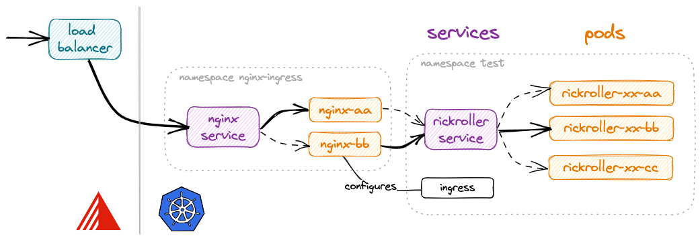

First, let's deploy our rickroller application the "manual" way.

## Namespaces

Kubernetes comes with *namespaces*, a way to partition resources within a cluster into **virtual clusters**,
or groups. Each namespace can have different policies, access controls, quotas etc. and are by default a bit isolated.
They also provide a scope for names: names of resources need to be unique within a namespace, but not across namespaces.
See [Kubernetes namespaces isolation - what it is, what it isn't, life, universe and everything](
https://www.synacktiv.com/en/publications/kubernetes-namespaces-isolation-what-it-is-what-it-isnt-life-universe-and-everything.html).

If you don't specify a namespace, kubectl will connect to the default namespace idiomatically named `default`.
You can easily create a namespace using `kubectl create namespace <name>`, and target it using
the global `-n <name>` flag.

To make a namespace the default for a session, you can try playing with kubectl contexts, or more
conveniently install [`kubectx` + `kubens`](https://github.com/ahmetb/kubectx).

```bash
# create a namespace called test
kubectl create namespace test
# make it the default for all subsequent commands (that do not use -n)
kubens test
```

## Deploy in a pod

The simplest way to get our Docker image running in k8s is to create a pod.

Either run `kubectl run rickroller --image=derlin/rickroller:latest --port 8080`, or
create the following YAML and apply it using `kubectl apply -f` (both are equivalent):

```yaml title="kube/pod.yaml"
--8<-- "kube/pod.yaml"
```

Ensure it is running using: `kubectl get pod`. 
How can we access it? The easiest way is to create a port forward:

```bash
kubectl port-forward pod/rickroller 8888:8080
```

You can now navigate to [http://localhost:8888](http://localhost:8888).

## What are pods exactly?

Pods are the smallest deployable unit on Kubernetes and the core of everything.

A Pod is a self-sufficient higher-level construct.
It is rather like a container, with a big difference: it can have **multiple containers**.
All pod's containers run on the same machine (cluster node), their lifecycle is synchronized, and mutual isolation is weakened to
simplify the inter-container communication.

???+ note "A deeper look"

    


    A Docker container is implemented using [cgroups](https://man7.org/linux/man-pages/man7/cgroups.7.html)
    and [namespaces](https://man7.org/linux/man-pages/man7/namespaces.7.html).
    Usually, containers are isolated using the following namespaces:

    * `mnt` (Mount) - the container has an isolated mount table.
    * `uts` (UNIX Time-Sharing) - the container can have its own hostname and domain name.
    * `ipc` (Interprocess Communication) - processes inside the container can communicate via system-level IPC only to processes inside the same container.
    * `pid` (Process ID) - processes inside the container are only able to see other processes inside the same container or inside the same pid namespace.
    * `net` (Network) - the container gets its own network stack.

    With pods, some of the above namespaces (`ipc`, `uts`, `net`) are shared between the containers,
    which weakens their isolation to allow for easier communication. More namespaces can be shared on-demand.

    ⮕ Learn more: [Containers vs. Pods - Taking a Deeper Look](https://iximiuz.com/en/posts/containers-vs-pods/)


This means we could run another container inside the `rickroller` pod and access it using localhost.
Here is an example (run `kubectl delete pod rickroller` first, then use `kubectl apply -f`):
```yaml
apiVersion: v1
kind: Pod
metadata:
  name: rickroller
spec:
  containers:
    - name: sh
      image: busybox
      command: ['sh', '-c', 'while 1; do sleep 10; done']
    - name: rickroller
      image: derlin/rickroller:latest
      ports:
        - containerPort: 8080
```

Now, let's get the index from the busybox container:
```bash
kubectl exec rickroller --container sh -- wget localhost:8080 -O -
```

As you can see, we can communicate with the rickroller container from the sh container on localhost!

Don't forget to remove the pod: `kubectl delete pod rickroller`.

??? tip "Another sidecar example"

    Sidecars are way more interesting when it comes to e.g. providing authentication, exposing logs, etc.
    Here is another example, this time with a shared volume:
    ```yaml
    apiVersion: v1
    kind: Pod
    metadata:
      name: example
      labels:
        app: webapp
    spec:
      containers:
        - name: app
          image: nginx
          ports:
            - containerPort: 80
          volumeMounts:
            - name: shared-logs
              mountPath: /var/log/nginx
        - name: sidecar
          image: busybox
          command: ["sh", "-c", "touch /var/log/nginx/access.log; tail -F /var/log/nginx/access.log"]
          volumeMounts:
            - name: shared-logs
              mountPath: /var/log/nginx
      volumes:
        - name: shared-logs
          emptyDir: {}
    ```
    Try it!

## Deployments, StatefulSets, ReplicatSets

Pods are usually never created directly but managed with higher-level resources.

There are two (three) main common abstractions that simplify the management of containerized applications.
you define a desired state and let k8s take care of the details (create, scale, update, etc.) of the underlying containers and pods.

`Deployments`
:   Deployments provide a declarative way to manage the creation and scaling of a set of identical pods. You provide a pod template, and it
takes care of creating the necessary ReplicaSets that will in turn ensure the desired number of pods are running.

`StatefulSets`
:   StatefulSets are similar to Deployments, but are used for stateful applications that require stable network identities, persistent storage, and ordered deployment and scaling.
For example, the name of the pods will always look the same (e.g. `<name>-0`) instead of having a random UUID.

(`ReplicaSets`)
:   ReplicaSets are used by `Deployments` and `StatefulSets` to manage the desired number of replicas (i.e., identical instances) of a pod template.
Each replicaset is configured with a minimum, maximum, and desired number of replicas, and will do all the necessary actions to ensure those values are respected.
You usually don't create them directly but know they are here.

In the case of rickroller, the web app should be handled by a `Deployment`, while a database will likely use a `StatefulSet` as it requires persistent storage.

## Using a Deployment

Deployments can be created using YAML or directly through kubectl. Via kubectl:

```bash
kubectl create deployment rickroller --image=derlin/rickroller:latest --port=8080 -o yaml # --dry-run=client 
```

Or using a yaml file:
```yaml title="kube/depl.yaml"
--8<-- "kube/depl.yaml"
```

Note the `spec.selector.matchLabels` and the `spec.template.metadata.labels`.
The selector is used to determine which pods are part of this deployment, and thus the number of instances running.

By creating the deployment, we should see 1 pod, 1 replicaset and 1 deployment:

```bash
kubectl get all
```
``` { .bash .no-copy }
NAME                             READY   STATUS    RESTARTS   AGE
pod/rickroller-dd4b47459-j9mdg   1/1     Running   0          25s

NAME                         READY   UP-TO-DATE   AVAILABLE   AGE
deployment.apps/rickroller   1/1     1            1           25s

NAME                                   DESIRED   CURRENT   READY   AGE
replicaset.apps/rickroller-dd4b47459   1         1         1       25s
```

Now, let's see how useful a deployment is. First, let's say there is huge traffic and we need to **scale horizontally**.
For this, run:
```bash
kubectl scale deployment rickroller --replicas=3 # or 100, or 0 :)
```
You can achieve the same by editing the deployment directly and changing the `spec.replicaCount`
(using e.g. `kubectl edit` or `kubectl apply`).

Let's also test **fault tolerance**. Delete one or more pods and see what happens. For example:
```bash
kubectl delete $(kubectl get pod -o name | grep rickroller | head -1)
```
A new pod is spawned immediately to take its place. Note that you can use
`kubectl get pod -w` on a terminal if you do not have a UI (`-w` is for `--watch`).

Now, we need to perform an **upgrade**.
First, ensure you have either the UI opened to the pods view, or type `kubectl get pod -w`
on a new terminal window.
We will simulate an update by adding an environment variable to the pods called `BEHIND_PROXY`
(this tells rickroller to honor the `X-Forwarded-*` headers, if any, which will be useful later):
```bash
kubectl edit deploy rickroller
## under .spec.template.spec.containers[0], add the following:
##   image: ...
##   env:
##     - name: BEHIND_PROXY
##       value: "true"
## then save and exit (:wq on vim)
```

Or simply use the updated YAML found in `kube/env-depl.yaml` (ensure you have the
`spec.replicaCount` set to 3)!

When a Deployment is updated, the following steps happen:

1. Kubernetes creates a new ReplicaSet with the updated pod template.
3. Kubernetes starts scaling down the old ReplicaSet and scaling up the new ReplicaSet,
   replacing pods one at a time. Only when the new pod is running and ready will it start receiving
   traffic and the next pod will be upgraded. This is called the *rolling upgrade* strategy, which is the
   default for `Deployment` (see [`.spec.strategy.type`](https://kubernetes.io/docs/concepts/workloads/controllers/deployment/#strategy)).
4. the old ReplicaSet (scaled to 0 pods) stays around to allow for rollbacks in case of issues.

This process is designed to ensure that the update is rolled out gradually, with minimal disruption to the application, 
and that the old version of the application can easily be rolled back if necessary.

Finally, let's say the upgrade didn't go well and we need to **roll back to the previous version**.
This time, look at the replicasets and run:
```bash
kubectl rollout undo deployment/rickroller
```

Finally, look at the history by typing:
```bash
kubectl rollout history deployment/rickroller
```

Cool, right?

??? note "The pod-template-hash label"

    If you inspect the replicatset, you should see something like:
    ```yaml
    spec:
      selector:
        matchLabels:
          app: rickroller
          pod-template-hash: dd4b47459  # <- ?
    ```
    This pod template hash is also found in the name of the pods: `<name>-<pod-hash>-<random>`.
    This label is what allows multiple replicaset to run for the same application.


## Services

Now that we have our pod running and fault tolerant, we need a way to communicate
with rickroller in a stable manner. With Deployments and ReplicaSets, the pods come and go, so we cannot use their
IP address or hostname. How? By using a `Service`.

A service can be thought of as a receptionist at the front desk of a building.
Just like a receptionist directs visitors to different departments in the building, a Kubernetes service
directs network traffic to different pods in a cluster.
It acts as a single entry point to access a group of pods providing the same service and ensures that traffic is evenly distributed among them.
The way it directs traffic is by default round-robin, but can be customized to use session affinity or other means.

There are three types of services:

ClusterIP
:   This is the default type of service and provides a stable IP address that can be used to access a set of pods within the same cluster. It is used for internal communication within the cluster.

NodePort
:   This type of service exposes the service on a static port on each node in the cluster, allowing external traffic to access the service. It is useful for testing and development purposes.

LoadBalancer
:   This type of service exposes the service on a load balancer in cloud environments such as AWS or GCP, allowing external traffic to access the service. It is useful for production environments where high availability is required.

Let's create a service for the rickroller application. Since Exoscale provides support for load balancers, we can use the `loadbalancer` type - note 
that it will take a minute, as Exoscale needs to provision a brand new load balancer (look at the Exoscale console):
```bash
kubectl create service loadbalancer rickroller --tcp=80:8080 # -o yaml --dry-run=client
```

Or use the YAML:
```yaml title="kube/lb-svc.yaml"
--8<-- "kube/lb-svc.yaml"
```

To get the load balancer IP (that you can use in a browser), run the following and look for *LoadBalancer Ingress*:
```bash
kubectl describe svc rickroller # svc is short for service
```

To see to which pods the service redirects traffic, use:
```bash
kubectl get endpoints rickroller
```

## Ingresses

When we set up the cluster, I said we installed the NGINX ingress controller.
This lets us use only one cloud load balancer for multiple applications thanks to ingresses.

Ingresses are a way to map a host or a route (e.g. a prefix) to a given service or app.
The ingress controller is the component behind the load balancer, which is responsible for reacting to those ingresses,
and for configuring networking properly.
Without more details, remember that ingresses are great, but do nothing if you haven't installed
at least one ingress controller.

To use an ingress, let's change our service above to use a cluster IP instead of a load balancer:
```bash
kubectl delete svc rickroller # delete the old service (may take some time)
# use the command below, or change LoadBalancer -> ClusterIP in the YAML above (see kube/svc.yaml)
kubectl create svc clusterip rickroller --tcp=80:8080
```

Here is how to create an ingress for rickroller, assuming the Nginx ingress controller is used:
```yaml
apiVersion: networking.k8s.io/v1
kind: Ingress
metadata:
  name: rickroller
  annotations:
    # Tell k8s to use the ingress controller
    kubernetes.io/ingress.class: "nginx"
    # ↓ Annotations to configure nginx
    nginx.ingress.kubernetes.io/use-regex: "true"
    nginx.ingress.kubernetes.io/rewrite-target: /$2
    nginx.ingress.kubernetes.io/x-forwarded-prefix: /rickroller
spec:
  rules:
    - http:
        paths:
          - path: /rickroller(/|$)(.*)
            pathType: Prefix
            backend:
              service:
                name: rickroller
                port: # this is the port of the ClusterIP service
                  number: 80
```

The above ingress tells the Nginx controller to direct incoming traffic with path `/rickroller` to the
service rickroller on port 80. Moreover, the annotations ask Nginx to strip the prefix when forwarding
and to set the `X-Forwarded-*` annotations.

!!! info "Nginx Ingress Controller Overview"

    

    The figure above shows how it works with the SKS cluster (Exoscale) and the Nginx Ingress Controller.
    
    The Nginx Ingress Controller defines a `Service` of type `LoadBalancer`, and thus receives an
    external IP from Exoscale. It then routes to one of the running Nginx pods running the Nginx reverse-proxy.
    The Nginx configuration (viewable in the pods at `/etc/nginx/nginx.conf`) is updated every time something
    happens with an Ingress.
    In our case, we create an ingress that asks Nginx to route the `/rickroller` prefix to the rickroller service,
    which knows how to forward it to one of the rickroller pods.

    The user can thus type `http://<load-balancer-ip>/rickroller` in the browser to get to the rickroller app!
    

??? tip "Have a look at the Nginx configuration"

    If you are curious, you can spawn a shell inside one of the `ingress-nginx-controller-xxx` pods running in the
    `ingress-nginx` namespace, and look into the `/etc/nginx/nginx.conf`:
    ```bash
    kubectl -n ingress-nginx exec $(kubectl -n ingress-nginx get pod -o name | grep controller | head -1) -- \
    cat /etc/nginx/nginx.conf | grep -a6 rickroller

		location ~* "^/rickroller" {
			
			set $namespace      "test";
			set $ingress_name   "roller";
			set $service_name   "roller";
			set $service_port   "80";
			set $location_path  "/rickroller";
			set $global_rate_limit_exceeding n;
			
			rewrite_by_lua_block {
				lua_ingress.rewrite({
					force_ssl_redirect = false,
					ssl_redirect = true,
        --
			
			# In case of errors try the next upstream server before returning an error
			proxy_next_upstream                     error timeout;
			proxy_next_upstream_timeout             0;
			proxy_next_upstream_tries               3;
			
			rewrite "(?i)/rickroller" /$2 break;
			proxy_set_header X-Forwarded-Prefix "/rickroller";
			proxy_pass http://upstream_balancer;
			
			proxy_redirect                          off;
			
		}
    ```
    That's it! A simple Nginx reverse-proxy with a dynamic configuration.

The application needs to support residing behind a reverse proxy (it receives traffic under `/`, but is reachable under `/rickroller`).
This is the case of rickroller, given we tell him to by setting the `BEHIND_PROXY` environment variable.
To do so, ensure you are using the `kube/depl-update.yaml` definition:

```yaml title="kube/env-depl.yaml"
--8<-- "kube/env-depl.yaml"
```

!!! note
    
    Environment variables can also be added through [`ConfigMaps`](https://kubernetes.io/docs/concepts/configuration/configmap/),
    but I will let you discover this by yourself.

## Recap'

Kubernetes **Pods** are like regular containers but can have one or more containers sharing the same network stack, hostname, and memory.
We never directly deploy pods, but use higher levels abstractions such as **Deployments** for stateless applications, and **StatefulSets**
for stateful apps. Deployments and StatefulSets use `ReplicaSet` under the hood to scale pods up and down, manage rolling upgrades,
and implement fault tolerance.

Since an application can run on multiple pods, and the latter are ephemeral (they can be killed, moved to other nodes, etc),
we use a **Service** to provide a single point of entry (IP address and hostname).
The service constantly tracks the pods part of the same application and knows how to redirect traffic.
Services are usually used internally, but they can be exposed to the outside using a load balancer or a node port.

Finally, a typical way of accessing applications from the outside is to create an **Ingress**. Ingresses are special constructs that
do nothing until an ingress controller is installed on the cluster. In our example, we used the Nginx ingress controller, which
has a load balancer IP and redirects traffic to internal services using Nginx. Whenever an ingress is created or updated, the controller updates the
Nginx configuration accordingly. The usual features of Nginx are available, with routing based on hostnames, path prefixes, etc.
