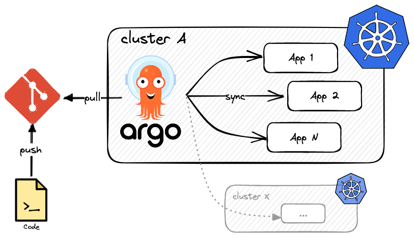

We now have an easy way to deploy and update a complex project using helm and helmfile
but we still have to perform these actions manually!
How can we automate this and follow GitOps principles?
Enter [Argo CD](https://argo-cd.readthedocs.io/en/stable/), a declarative, GitOps continuous
delivery tool for Kubernetes.



Argo CD follows the GitOps pattern of using Git repositories as the source of truth for defining the desired application state.
Kubernetes manifests can be specified in several ways: kustomize applications, helm charts, plain YAML manifests, and more.
It then automates the deployment of the desired application states in the specified target environments by watching the changes
in your git repo (via webhooks) and applying them in a continuous, self-healing manner.

Application deployments can track updates to branches, tags, or pinned to a specific version of manifests at a Git commit.

Argo CD needs to be installed on a Kubernetes cluster, and can from there drive other clusters (multi-clusters support).
This is a very powerful pattern that is used by many organizations to manage complex infrastructures.

!!! note

    Another great contender of Argo CD is [Flux CD](https://fluxcd.io).

## Argo CD and helmfile

There is sadly **no built-in support for helmfile**, despite an [open issue](https://github.com/argoproj/argo-cd/issues/2143) from August 2019.

One way to keep using helmfile is to have a CI workflow that uses `helmfile template` and saves the output as raw YAML manifests that can be
later used by Argo CD. Another way is to use plugins. I found and tested two of them:

* [travisghansen/argo-cd-helmfile](https://github.com/travisghansen/argo-cd-helmfile): this plugin is referenced directly in the open issue.
  It works well and has tons of options, but there is currently a bug in the Argo CD interface that prevents you from creating an `AppProject`
  directly from the UI using helmfile. All works great if you use the argocd CLI though.
* [lucj/argocd-helmfile-plugin](https://github.com/lucj/argocd-helmfile-plugin): this plugin is fairly basic but works.


## Installing Argo CD

Argo CD can be installed using helm or plain Manifests. Since we are using plugins and are now familiar with helmfile, let's install it this way:

```yaml title="argo-cd/install/helmfile.yaml"
--8<-- "argo-cd/install/helmfile.yaml"
```

Install it using:
```bash
helmfile -f argo-cd/install/helmfile.yaml sync 
```

Now that ArgoCD is installed, connect to the UI by creating a port-forward:

```bash
kubectl port-forward -n argocd svc/argocd-server 7000:80
```

ArgoCD is now available at [https://localhost:7000](https://localhost:7000).

The initial `admin` password is stored in a secret called `argocd-initial-admin-secret` in the `argocd` namespace.
You can get it easily by executing:
```bash
kubectl -n argocd get secret argocd-initial-admin-secret -o jsonpath="{.data.password}" | base64 -d
```

Once you log in using the `admin` user and the password above, ensure you:

1. delete the secret (`kubectl -n argocd delete secret argocd-initial-admin-secret`),
2. change the admin password by clicking on the *User Info* in the left menu bar, then *Update Password*.


## Basics of Argo CD

Argo CD registers new Kubernetes Custom Resources (CRs) that define new resource kinds.
Those can be managed using kubectl, as regular built-in resources.

Argo CD has three constructs, defined in three different custom resource definitions or Kubernetes objects:

* An `AppProject` is a high-level grouping mechanism in Argo CD that allows defining access controls and configuration overrides for a set of related applications.
* An `Application` is a Kubernetes manifest and a set of parameters that define how a specific application should be deployed and managed by Argo CD.
  It defines a source repository, the tool used (helm, etc), the destination cluster, etc.
* An `ApplicationSet` is a higher-level concept that allows defining multiple Applications with similar characteristics using templates, parameters and sources.
  It enables scaling the number of Application instances with variations in parameters, labels, and annotations.
  It can, for example, be used to spawn temporary environments when a pull request is created.

Note that you can create an app that creates other apps, which in turn can create other apps.
This allows you to declaratively manage a group of apps that can be deployed and configured in concert.

??? note "Viewing Custom Resources" 

    If you are curious, you can see the content of a CRD (Custom Resource Definition) using:
    ```bash
    kubectl get crd | grep argo
    appprojects.argoproj.io                                 2023-04-18T12:27:11Z
    applications.argoproj.io                                2023-04-18T12:27:11Z
    applicationsets.argoproj.io                             2023-04-18T12:27:11Z
    ```
    ```bash
    kubectl get crd applications.argoproj.io -o yaml
    ```

    You also query the instances of each crd using `kubectl get`. To discover the name you must use:
    ```bash
    kubectl api-resources | grep argo 
    applications     app,apps          argoproj.io/v1alpha1  true  Application
    applicationsets  appset,appsets    argoproj.io/v1alpha1  true  ApplicationSet
    appprojects      appproj,appprojs  argoproj.io/v1alpha1  true  AppProject
    ```
    Hence, for applications, use `kubectl get apps`.

To create one of those resources, we can:

* Use the Argo CD UI,
* Use the `argocd` CLI, or
* Use a YAML file and `kubectl apply`.


### The App Project

By default, argocd creates a `default` App Project that has no restriction.
Using `default`, you can deploy anything from and to anywhere.

??? tip "How to see the default project definition"

    Use your Kubernetes knowledge!

    ```bash
    kubectl get appprojects -n argocd default -o yaml
    ```

    ```yaml
    apiVersion: argoproj.io/v1alpha1
    kind: AppProject
    metadata:
      creationTimestamp: "2023-04-18T12:27:34Z"
      generation: 1
      name: default
      namespace: argocd
      resourceVersion: "362197"
      uid: 2c95d565-7b55-4f60-a253-002704b82b15
    spec:
      clusterResourceWhitelist:
      - group: '*'
        kind: '*'
      destinations:
      - namespace: '*'
        server: '*'
      sourceRepos:
      - '*'
    status: {}
    ```

Usually, we want to tighten security. For this demo, we will use the following `AppProject`.
It creates a project called `demo` that limits the sources to one of my GitHub repositories ([github.com/derlin](https://github.com/derlin))
and only allows certain kinds of resources to be created. The two namespaces `kube-system` and `argocd` are also restricted: they cannot be used
by an app as a destination.

```yaml title="argo-cd/appproject-demo.yaml"
--8<-- "argo-cd/appproject-demo.yaml"
```

Create the project using `kubectl apply`.
You should be able to now see the project in the Argo CD UI, under *Settings* > *Projects*.

### The App

Now that we have a project, we can create an app to deploy rickroller. Defining an app is quite straightforward:

```yaml title="argo-cd/app-rickroller.yaml"
--8<-- "argo-cd/app-rickroller.yaml"
```

Create the app using `kubectl apply`.
You should now see the app under *Applications*. Watch how Argo CD syncs all resources and deploys rickroller automatically! Isn't it great?

!!! tip "Using the argo CLI"

    You can perform the same operations (and more, such as syncing) using the `argocd` CLI. As an example, here is how you could create
    the rickroller App from the terminal:
    ```yaml
    --8<-- "argo-cd/app-rickroller.sh"
    ```


## What now?

Now that we have our Argo CD set, we can commit and push any change and wait for the magic to happen.
Since the app is configured with *sync enabled*, you should see your changes applied after around three minutes of committing.
Why three minutes? Because Argo CD polls git repositories every three minutes to detect changes to the manifests.

> The automatic sync interval is determined by the `timeout.reconciliation` value in the `argocd-cm` ConfigMap, which defaults to 180s (3 minutes).

If you want Argo CD to be more reactive, you will need to set up a [webhook](https://argo-cd.readthedocs.io/en/stable/operator-manual/webhook/).
This, of course, assumes your Argo CD instance is reachable from the outside.