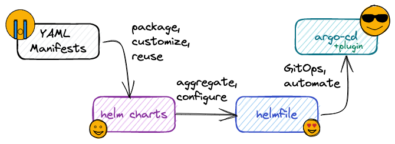

In summary:

* Kubernetes Manifests are the basic way of deploying things to kubernetes
    * raw YAML files: no portability, no customisation, no code reuse
* Use [Helm](https://helm.sh) to package manifests into installable units
    * powerful templating (Go Templates), rich context information and parameters (values.yaml)
    * possible to publish Helm charts to registries (sharing)
    * umbrella charts to group multiple charts under a parent one (sub-charts)
* Use [helmfile](https://helmfile.readthedocs.io/) to group and manage multiple helm charts as one
    * you still have separate helm releases (vs umbrella chart)
    * declarative YAML with many features (envs, templates)
    * powerful CLI with tons of options
* Use [Argo CD](https://argo-cd.readthedocs.io/) to add GitOps and automation to the mix
    * automatically syncs the state defined in a git repo with one or more clusters
    * supports raw manifests, kustomize, helm, jsonnet, … (+ helmfile through a plugin) 
    * and much more! multi-cluster support, ApplicationSets, etc.

I hope you enjoyed this tutorial. Please, leave a :star: on the [github repo](
https://github.com/derlin/fribourg-linux-seminar-k8s-deploy-like-a-pro), it will help me stay motivated.